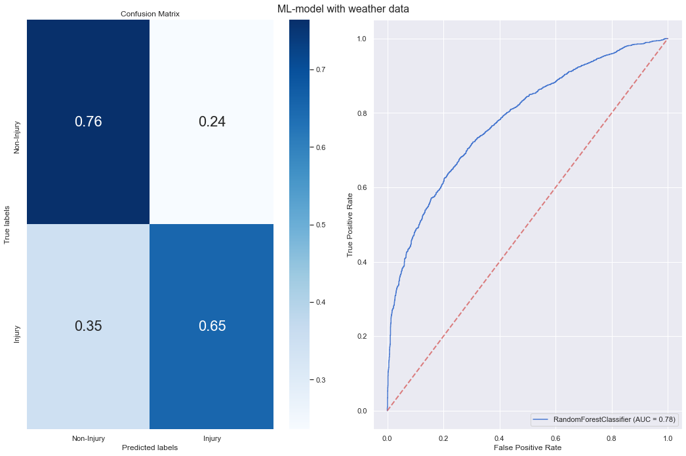
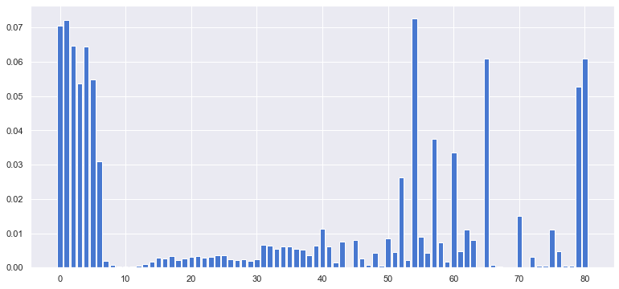

# NYC Vehicle crashes 

Since 2012 more than 1,000,000 traffic accidents have occured in New York. As a result of those accidents around 200,000 people have gotten injured. In fact, traffic incidents are the leading cause of injuries in New York City. The aim of this project is to visualize, analyze and model the traffic incidents in order to find identifiable patterns that could aid the process of reducing the risk of injuries in New York City. To enable this, the Motor Vehicle Collisions data sets from NYC database is used (the data can be found here: [Crash Data](https://data.cityofnewyork.us/Public-Safety/Motor-Vehicle-Collisions-Crashes/h9gi-nx95), [Vehicle Data](https://data.cityofnewyork.us/Public-Safety/Motor-Vehicle-Collisions-Vehicles/bm4k-52h4) and [Persons Data](https://data.cityofnewyork.us/Public-Safety/Motor-Vehicle-Collisions-Person/f55k-p6yu)).

More specifically, we ask the following questions; 

* Where and when are the crashes happening? 
    * Based on the different boroughs in NYC, the GPS locations and time and day of the crashes.
* What are the leading causes of these accidents?
    * Alcohol involvement and outside-of-the-car distractions are looked into.
* What vehicles are often involved?
    * A large number of vehicle types are reported in the crash data sets.

All vizualisations generated in this study can be found at INSERT REF EXP NOTEBOOK.

## New York through data
As mentioned, lots of car crashes happen every day in NYC. In fact, so many happen that we are able to visualize the entire city just based on the GPS location of the individual crashes, when we sample over the 8 year span in which the data has been gathered (2012 - 2020). From the map below, we can recognize some of NYCs famous features such as Central Park in Manhattan (the black square in the left-most area) and the Hudson river which encircles the Manhattan peninsula. 

<iframe src="map.html"
    sandbox="allow-same-origin allow-scripts"
    width="100%"
    height="600"
    scrolling="no"
    seamless="seamless"
    frameborder="0">
</iframe>

By using the data freely available to us, we hope to broaden ours and yours understanding of the city based solely on the car crash data sets. A big task, we know, but stay with us!

## Basic statistics 
The goal of the following visualizations are primarily to get you, the reader, up to speed on how the distribution of car crashes looks like in NYC. What is the maximum number of people killed in a single car crash? What is the maximum number injured? How does the different age groups fare in the statistics? Where does the most of the car crashes happen? Lots of plots, but they hide some very interesting information if analyzed a bit!

### Injuries and distribution in the boroughs
Using the data sets, we have plotted the number of persons, pedestrians, cyclists and motorists injured along with the number of persons killed on a logarithmic plot. This gives us a feeling for how many crashes are severe in a sense that they inflict injuries or even deaths. Fortunately, most crashes across all the trafic groups are seen to be non-lethal and even non-harmful. But still, a significant number of them result in an injury, and a few of them even have multiple people injured. If we look at the last columns of the persons, pedestrians and motorist plots, we can see a few which have a lot of people involved in the crash (43 persons injured in the same car crash!).

Furthermore, the number of trafic accidents across the 5 boroughs in NYC are plotted in a bar plot, showing that Brooklyn has the highest number of car crashes when we count them up over the 8 year time span.

<iframe src="yearly_borough.html"
    sandbox="allow-same-origin allow-scripts"
    width="100%"
    height="500"
    scrolling="no"
    seamless="seamless"
    frameborder="0">
</iframe>

Building upon the crashes in the boroughs, we have plotted the yearly development for each borough, where the succes in reducing the number of crashes for i.e. Manhattan can be seen. This could be due to a program initialized in 2014 called 'Vision Zero', which was aimed at reducing the amount of injuries related to vehicle accidents. A link to the program can be found [here](https://www1.nyc.gov/content/visionzero/pages/). This program continues to this day, and employs increased trafic control (harder penalties for speeding, failing to yield to pedestrians etc.). As such, it wouldn't surpise us if this is the cause of this drop in injuries.

### Crash distribution heatmap
Now we move on to the more number-heavy plots, where the number of crashes in each month (1 being January and 12 being December) are shown for the time period 2012-2020.

The thing worth noticing here is the smaler amount of accidents early in the year and the increase in reported 
accidents from 2015 to 2018 (the increase in dark colors). The summer of 2016-2018 saw an increase of around
1500-2000 accidents compared to earlier years. It is dificult to predict what the main contributing factors were here. 
Our initial guess was that higher temperatures in this period could contribute to higher outside traffic. However,
according to the National Wheather Service, the summers of 2016-2018 in New York where not distinctly warmer than previous
years [Central Park annual temperatures](https://www.weather.gov/media/okx/Climate/CentralPark/monthlyannualtemp.pdf).
In 2014 New York initialized a 'Vision zero' program aimed at reducing the amount of injuries related to 
vehicle accidents [Vision zero](https://www1.nyc.gov/content/visionzero/pages/). 
This could either mean that the program was not very succesfull or that this program increased awareness around vehicle accidents leading to more accidents beeing registered/reported without a significant change in actual accident numbers.

### Age group and gender distribution
<iframe src="Crashes_agegroups.html"
    sandbox="allow-same-origin allow-scripts"
    width="100%"
    height="600"
    scrolling="no"
    seamless="seamless"
    frameborder="0">
</iframe>

## Spatial distribution of the car crashes
<iframe src="interaktivfoliummap.html"
    sandbox="allow-same-origin allow-scripts"
    width="100%"
    height="600"
    scrolling="no"
    seamless="seamless"
    frameborder="0">
</iframe>

### Dangerous roads
We now turn our attention to the roads in New York. It is expected that some roads are more prone to have accidents than others,
due to factors like heavy traffic, poor road conditions, traffic nodes etc. 
The figure below shows the roads with the highest accident counts for each borough.

<iframe src="Dangerous.html"
    sandbox="allow-same-origin allow-scripts"
    width="100%"
    height="500"
    scrolling="no"
    seamless="seamless"
    frameborder="0">
</iframe>

For near all boroughs, there are one or two roads responsible for a large portion of the crashes. In Queens for example, **Northern Boulevard** and 
**Queens Boulevard** have around 100% and 50% more crashes than **Woodhaven Boulevard**. 
Unless the reader is very well versed in New Yorks street plan, the location and
names of these roads are likely unfamiliar. To better get a picture of the location and length of these roads,
the crashes for the top three dangerous roads in each borough are visualized in a map below. 

<iframe src="roadmap.html"
    sandbox="allow-same-origin allow-scripts"
    width="100%"
    height="800"
    scrolling="no"
    seamless="seamless"
    frameborder="0">
</iframe>

[Map containing crashes at dangerous roads](./roadmap.html)

### Temporal distributions of the car crashes
<iframe src="Crashes_hours_weeks_months.html"
    sandbox="allow-same-origin allow-scripts"
    width="100%"
    height="1600"
    scrolling="no"
    seamless="seamless"
    frameborder="0">
</iframe>

## Machine learning 
Traffic accident prediction is very difficult and requires non-accident data. It was therefore chosen to see if it was possible to predict whether an injury will occur in a traffic accident. Our hypothesis is that traffic injuries don't arise in a purely stochastic manner. It is believed their occurence is influenced by a multitude of factors such as drivers' physical conditions, car types, traffic condition and weather. 
In this section we will therefore investigate the possibility of predicting whether or not a traffic incident will involve an injury.

To do this two different machine learning models are used and tested on different feature sets. We are predicting on the "NUMBER OF INJURY" column and have transformed the column into a binary variable by combining all injuries over 0 to 1. Therefore it has been made into a binary classification problem. 

bla bla bla something with weather model and it didnt predict better

 

<iframe src="foliumML.html"
    sandbox="allow-same-origin allow-scripts"
    width="100%"
    height="600"
    scrolling="no"
    seamless="seamless"
    frameborder="0">
</iframe>
